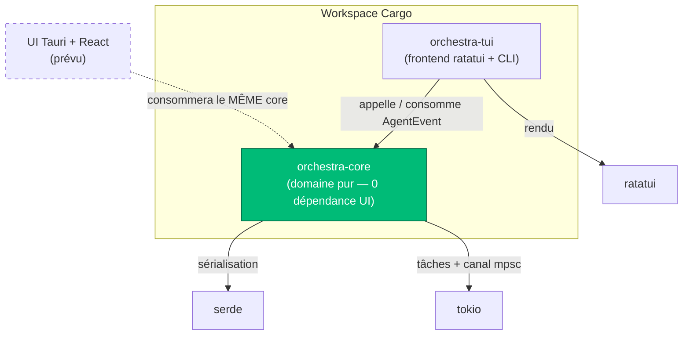
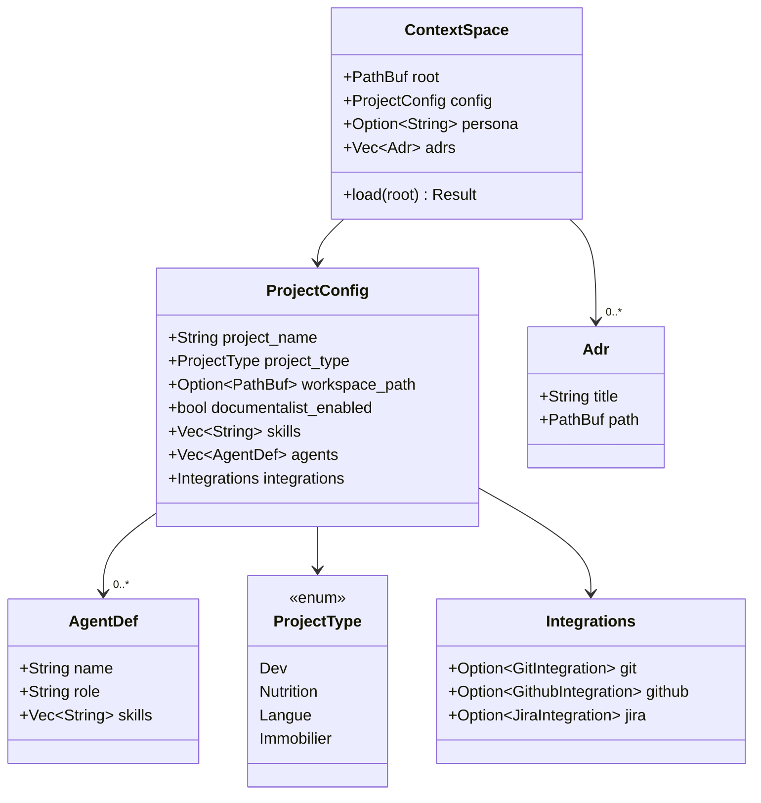
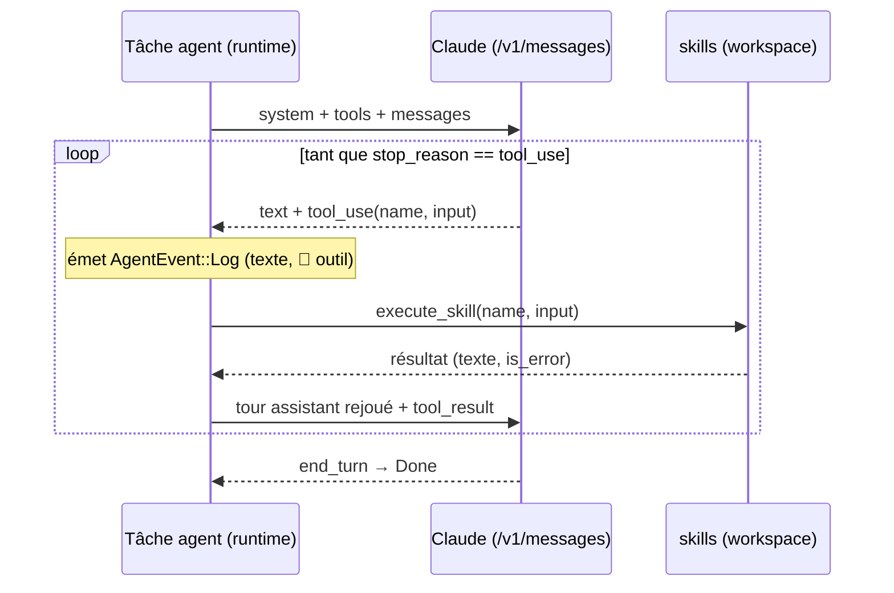
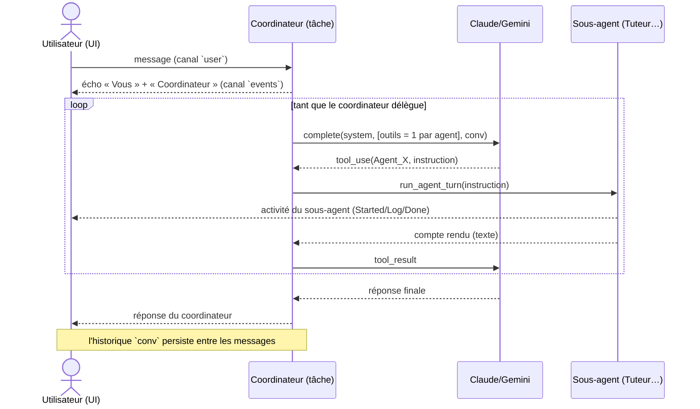
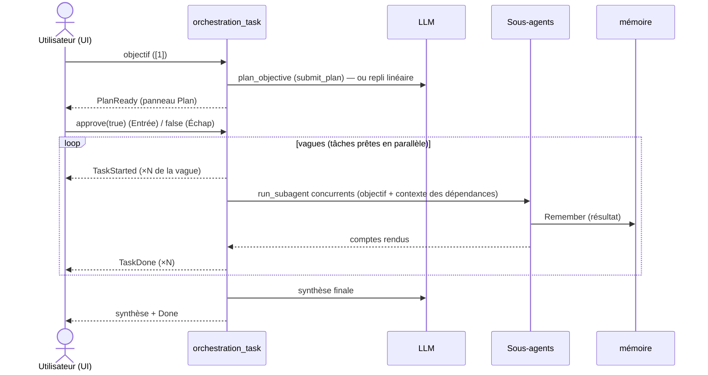
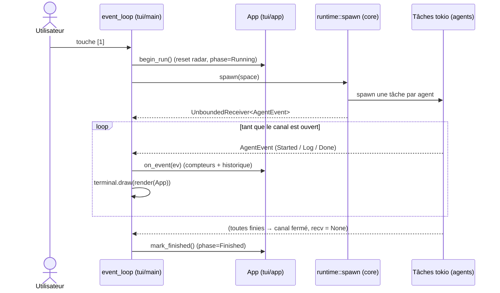
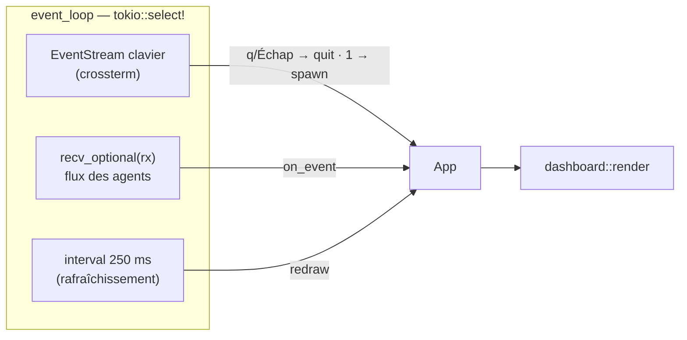

# Architecture technique — Orchestra IDE

> Doc technique vivante, mise à jour à chaque phase. Pour la vision produit et les
> parcours utilisateur, voir [`FONCTIONNEL.md`](./FONCTIONNEL.md) ; pour l'historique
> par phase, [`JOURNAL.md`](./JOURNAL.md).

## 1. Principe directeur : découplage strict métier / affichage

Orchestra IDE est un prototype Rust d'« IDE pour l'ère agentique ». Le TUI (`ratatui`)
est l'interface d'aujourd'hui ; un portage Tauri + React est prévu. Pour que ce portage
ne soit pas une réécriture, **toute la logique vit dans `orchestra-core`, qui ne dépend
d'AUCUNE bibliothèque d'affichage**. L'UI ne fait que :

1. appeler des fonctions du cœur (`scaffold_space`, `runtime::spawn`, `ContextSpace::load`) ;
2. consommer le type-contrat `AgentEvent`.

C'est l'invariant non négociable du projet. Toute évolution doit le préserver.

## 2. Vue d'ensemble des crates



| Crate | Rôle | Dépendances clés |
|---|---|---|
| `orchestra-core` | Modèle, scaffolding, runtime d'agents, contrat d'événements | `serde`, `serde_json`, `thiserror`, `tokio` |
| `orchestra-tui` | CLI (`init`) + tableau de bord temps réel | `orchestra-core`, `ratatui`, `tokio`, `futures`, `crossterm` |

### Arborescence des modules

```
crates/
├─ orchestra-core/src/
│  ├─ lib.rs            # ré-exports publics
│  ├─ error.rs          # OrchestraError (type d'erreur unique)
│  ├─ events.rs         # AgentEvent — contrat cœur ↔ UI
│  ├─ runtime.rs        # spawn() : lance les agents (boucle LLM ou simulée)
│  ├─ llm.rs            # LlmClient : Claude/Gemini au choix, en HTTP (Phase 4a) + prompt caching
│  ├─ skills.rs         # primitives exécutables via tool use — registre (Phase 4a, +Web_Fetch)
│  ├─ markdown_skill.rs # skills « fiches » SKILL.md + Load_Skill (divulgation progressive)
│  ├─ memory.rs         # mémoire partagée d'espace : Remember / Recall (.orchestra/memory.md)
│  ├─ orchestration.rs  # modèle de plan (Task/Plan, tri topo, validation, repli)
│  ├─ integrations.rs   # Skills Git (local) + GitHub (REST) (Phase 4b)
│  ├─ scaffold.rs       # scaffold_space() : crée un Espace (Phase 2)
│  └─ model/
│     ├─ project_type.rs  # enum ProjectType
│     ├─ config.rs        # ProjectConfig + Integrations
│     ├─ space.rs         # ContextSpace (+ Adr)
│     └─ skill_id.rs      # default_skills() / default_agents()
└─ orchestra-tui/src/
   ├─ main.rs           # dispatch CLI + boucle async tokio::select!
   ├─ app.rs            # App : état agrégé du dashboard (sans ratatui)
   ├─ dashboard.rs      # rendu des zones (en-tête / radar / docs / agents / menu)
   ├─ editor.rs         # mini-éditeur texte (persona & fiches de skill)
   ├─ markdown.rs       # rendu Markdown → lignes ratatui (visualiseur)
   └─ wizard.rs         # assistant interactif `orchestra init`
```

## 3. Modèle de données — l'« Espace de Contexte »

Le concept central est volontairement **agnostique** : un projet Dev, Nutrition, Langue
ou Immobilier partage la même structure ; seuls les Skills, agents et intégrations
diffèrent.



Sur le disque, un Espace est un dossier contenant :

```
<espace>/.orchestra/
├─ config.json     # sérialisation de ProjectConfig
├─ persona.md      # contexte/critères rédigés par l'utilisateur
├─ memory.md       # mémoire partagée des agents (créée à la 1re note)
├─ skills/         # fiches de skills : <id>/SKILL.md
└─ adr/            # Architecture Decision Records (*.md)
```

**Règle d'accès** : l'UI ne touche jamais au système de fichiers. Elle passe par
`ContextSpace::load` / `scaffold_space`. Les intégrations ne stockent jamais de secret en
clair : seul le **nom** de la variable d'environnement du token est persisté
(`token_env_var`).

## 4. Contrat d'événements `AgentEvent`

Pivot du découplage temps réel. Figé tôt pour que l'UI puisse être écrite sans connaître
les agents.

```rust
enum AgentEvent {
    Started  { agent: String },
    Thinking { agent: String },                       // appel LLM en cours → pilote le spinner
    Log      { agent: String, msg: String },
    Done     { agent: String },
    // Orchestration réelle :
    PlanReady   { tasks: Vec<PlannedTask> },          // plan établi, en attente d'approbation
    TaskStarted { id: String, agent: String },        // une tâche du plan démarre
    TaskDone    { id: String },                       // tâche réussie
    TaskFailed  { id: String, error: String },        // tâche échouée
}
```

## 5. Runtime d'agents (Phase 3) et flux temps réel

`runtime::spawn(&ContextSpace) -> UnboundedReceiver<AgentEvent>` lance un agent par nom
présent dans `config.agents`, chacun comme une **tâche `tokio`**. Tous publient sur un
unique canal `tokio::sync::mpsc`. Le `Sender` original est lâché à la fin de `spawn` :
**quand tous les agents ont terminé, le canal se ferme et `recv()` renvoie `None`** —
c'est ainsi que l'UI sait, sans drapeau dédié, que l'orchestre est au repos.

Depuis la **Phase 4a**, chaque agent mène — si une clé API est présente — une vraie boucle
agentique Claude (voir §5bis). **Sans clé, ou si l'API échoue, le runtime retombe sur le
corps simulé** (`scripted_steps`, scénario scripté étalé dans le temps). `spawn` lit
`LlmClient::from_env()` ; un `spawn_inner(space, client)` interne, injectable, garde les
tests hors-ligne et déterministes.

## 5bis. Boucle agentique LLM + Skills exécutables (Phase 4a)

`orchestra-core::llm::LlmClient` appelle, en **HTTP brut** via `reqwest` (Rust n'a pas de
SDK officiel), l'un des deux fournisseurs **au choix** :

| Provider | Endpoint | Modèle par défaut | Clé |
|---|---|---|---|
| `Anthropic` (Claude) | `POST /v1/messages` | `claude-opus-4-8` | `ANTHROPIC_API_KEY` |
| `Gemini` | `…/{model}:generateContent` | `gemini-2.0-flash` | `GEMINI_API_KEY` |

Une représentation **neutre** (`Msg` / `Block` / `ToolSpec` / `ToolResult`) découple la
boucle agentique du format de chaque fournisseur : chaque provider *rend* cette
représentation dans son protocole (content blocks vs `functionCall`/`functionResponse`) et
*parse* sa réponse vers les mêmes `Block`. Le choix se fait via `ORCHESTRA_PROVIDER`
(prioritaire) ou par auto-détection de la clé présente ; le modèle est surchargeable par
`ORCHESTRA_MODEL`. `orchestra-core::skills` expose les Skills Dev comme *tools* et les
exécute côté Rust, confinés au workspace.



| Skill (tool) | Action | Garde-fou |
|---|---|---|
| `Read_File` | lit un fichier texte | chemin confiné au workspace |
| `Write_File_Validated` | écrit/remplace un fichier | idem + création des parents |
| `Execute_Terminal_Command` | commande shell dans le workspace | `cwd`=workspace, délai 30 s, sortie plafonnée |
| `Write_Mermaid_Diagram` | écrit un `.md` avec un bloc `mermaid` | type de diagramme validé |
| `Web_Fetch` | lit le contenu d'une URL | schémas `http(s)` uniquement, délai, sortie plafonnée |

**Le registre comme source de vérité.** `skills.rs` indexe chaque primitive par son id :
`tool_definition(id)` (définition exposée au LLM) + `execute_skill(id, …)` (exécution). La
liste `EXECUTABLE_SKILLS` (+ `is_executable`) énumère ce qui est branché ; `tool_specs(enabled)`
ne produit des outils que pour les skills assignés *présents au registre*. Ajouter une
primitive = une entrée au catalogue + un bras dans chaque match. Garde-fous : `safe_join`
refuse les chemins absolus et tout composant `..` ; la boucle est bornée à 6 tours ; un skill
inconnu du registre n'est pas exposé (le modèle ne voit que ce qu'il peut actionner).

**Prompt caching (Anthropic).** Le bloc `system` (projet + rôle + compétences + persona),
stable d'un tour et d'un agent à l'autre, est marqué `cache_control: ephemeral` dans
`anthropic_body` : les tours suivants paient une fraction des tokens d'entrée sur ce préfixe.

### Conversation avec un coordinateur (`[5]`)

En complément de l'exécution autonome (`[1]`), `runtime::start_conversation(space)` ouvre
une **conversation persistante** via une `ChatHandle { user, events }` (canal
**bidirectionnel** `mpsc` : l'UI envoie des messages sur `user`, reçoit les événements sur
`events`). Une tâche `tokio` tient la boucle :



**Pattern « agent-outil »** : chaque agent du roster est exposé au coordinateur comme un
outil (`delegation_tool`) ; quand le coordinateur l'invoque, `run_subagent` lance un *tour*
de cet agent (`run_agent_turn`, mutualisé avec le mode autonome) avec ses propres
prompt/outils, émet son activité sur le radar, et renvoie son texte comme `tool_result`. La
conversation se termine quand l'UI ferme le canal `user` (`Échap`).

**Orchestration depuis le chat** : le coordinateur dispose en plus d'un outil `orchestrate`
(`orchestrate_tool`). Quand il l'invoque, `run_coordinator_turn` appelle la boucle mutualisée
`run_orchestration` (la même que `[1]` — cf. section suivante) : plan → approbation →
exécution parallèle → auto-correction → synthèse. L'approbation passe par
`ChatHandle.approve` (réutilise l'écran de plan du TUI) ; la synthèse renvoyée devient le
`tool_result` que le coordinateur intègre à sa réponse, et le dialogue continue.

### Orchestration réelle (`[1]`) — plan → approbation → exécution → synthèse (post-Phase 5)

`runtime::orchestrate(space, objectif) -> OrchestrationHandle { approve, events }` fait
travailler l'orchestre comme un pipeline plutôt qu'en délégation plate. La tâche `tokio` :

1. **Planifie** (`plan_objective`) : via le LLM (outil `submit_plan` → `orchestration::parse_plan`)
   si une clé est présente et le plan **valide** (`Plan::validate` : ids uniques, agents connus,
   dépendances existantes, pas de cycle) ; sinon `orchestration::fallback_plan` (pipeline linéaire).
2. Émet `PlanReady` et **attend l'approbation** sur le canal `approve` (`true` = exécuter).
3. **Exécute** (`execute_plan`) par **vagues concurrentes** : à chaque vague, toutes les tâches
   dont les dépendances sont satisfaites sont lancées **en parallèle** (`futures::future::join_all`
   — les indépendantes avancent ensemble), chacune via `run_subagent` (mutualisé) avec en contexte
   (borné) les sorties de ses dépendances ; le résultat est **tracé en mémoire** (`memory::append`,
   hand-off). Émet `TaskStarted`/`TaskDone`. (`Plan::topo_order` reste utilisé par la validation.)
4. **Re-planification itérative** : après une manche, `evaluate_objective` (LLM) juge si
   l'objectif est atteint. Sinon, il renvoie un **plan correctif** (`submit_plan`) → retour à
   l'étape 2 (ré-affichage + ré-approbation), borné par `MAX_ROUNDS`. La mémoire fait le pont
   entre manches (les agents correctifs voient l'acquis). Mécanisme **agnostique** : aucun agent
   ni skill dédié — la boucle réutilise les agents de l'espace.
5. **Synthétise** les comptes rendus de toutes les manches en une réponse finale (`synthesize`).

`run_waves` exécute une manche (vagues concurrentes) et renvoie son transcript ; la boucle de
manches + l'évaluation vivent dans `orchestration_task`. Hors-ligne : pas d'évaluation → une
seule manche.

Le **modèle** (pur, testable) vit dans `orchestra-core::orchestration` (`Task`, `Plan`,
`TaskStatus`, tri topo, validation, repli) ; l'**exécution** asynchrone et les appels LLM
restent dans `runtime`. Hors-ligne, le plan de repli + un flux simulé gardent `[1]` fonctionnel.



### Intégrations Git / GitHub (Phase 4b)

`orchestra-core::integrations` ajoute des Skills **conditionnels** à la liste d'outils, en
fonction de `config.integrations` :

| Intégration | Skills | Exécution | Exposé si |
|---|---|---|---|
| Git (local) | `Git_Status`, `Git_Diff`, `Git_Create_Branch`, `Git_Commit` | binaire `git` dans le workspace | `integrations.git` présent |
| GitHub (REST) | `GitHub_List_Issues`, `GitHub_Create_Issue_Comment`, `GitHub_Create_Pull_Request` | API `api.github.com` (`reqwest`) | `integrations.github` présent **et** token (`token_env_var`) résolu |

Le runtime fusionne `skills::tool_specs`, `integrations::tool_definitions`, `Load_Skill` et
les outils de mémoire, puis dispatche chaque appel via une cascade `memory::handles` →
`markdown_skill::handles` → `integrations::handles` → registre `skills`. Token GitHub lu depuis
l'environnement (jamais en dur) ; seul son **nom de variable** est persisté dans la config.

### Skills « fiches » Markdown + divulgation progressive (post-Phase 5)

`orchestra-core::markdown_skill` charge les fiches `.orchestra/skills/<id>/SKILL.md` (en-tête
`name`/`description` + corps). Au lieu d'injecter le corps complet dans le prompt,
`build_system_prompt` n'y met que **nom + description** des fiches assignées (section
« Compétences ») ; l'agent charge la procédure à la demande via la primitive **`Load_Skill{id}`**
(`markdown_skill::execute`), exposée seulement s'il a au moins une fiche assignée. Gain de
tokens : le corps n'est payé qu'à l'usage, et le prompt raccourci profite aux deux fournisseurs.
Création/édition depuis l'UI (`[n]`) via `markdown_skill::create` / `save` — l'écriture disque
reste dans le cœur.

### Mémoire partagée d'espace (post-Phase 5)

`orchestra-core::memory` expose deux primitives **universelles** (tous les agents) :
`Remember{note}` (append attribué + numéroté dans `.orchestra/memory.md`) et `Recall{query?}`
(lecture filtrée par mot-clé). Aiguillage via `memory::handles` dans la boucle d'outils, comme
les intégrations ; le prompt ne porte qu'un rappel court (le contenu se lit à la demande). La
mémoire est durable entre sessions, listée par `ContextSpace::documents()` (navigateur `[2]`),
et sert de **compression de contexte** : une synthèse écrite une fois remplace les relectures.

### Agent Documentaliste (Phase 5)

Si `config.documentalist_enabled` est vrai, le runtime ajoute au roster un **Agent
Documentaliste** (en plus de `config.agents`). Il reçoit un prompt orienté documentation et
un jeu d'outils dédié (`skills::documentalist_tool_definitions` : `Read_File`,
`Write_File_Validated`, `Write_Mermaid_Diagram`) — indépendant de la liste de Skills du
projet. `Write_Mermaid_Diagram` écrit un `.md` contenant un bloc ` ```mermaid ` après
validation du type de diagramme.

### Finitions du dashboard (Phase 5)

`App` porte une `View` (`Radar`/`Docs`/`Agents`), un mode de saisie (`input`), un éditeur
(`editor: Option<Editor>` + `editor_target` : persona ou fiche de skill), un visualiseur
(`viewer: Option<Viewer>`) et un `notice`. La boucle clavier applique une **priorité de
modes** : éditeur → visualiseur → saisie d'agent → navigateur → commandes. Tout reste dans
l'outil :

- `[2]` ouvre le **navigateur de documents** : `ContextSpace::documents()` agrège le persona,
  la **mémoire** (`memory.md`), les ADRs et les Markdown du workspace (balayage borné, dossiers
  cachés/build ignorés). `Entrée` lit via `load_document()` et l'affiche dans le **visualiseur
  Markdown** (`orchestra-tui::markdown::to_lines`), avec défilement. Sur le persona, `e` édite.
- `[3]` charge un autre espace (`ContextSpace::load`).
- `[4]` ouvre l'**éditeur de persona** (`orchestra-tui::editor`, multi-ligne UTF-8 pur) ;
  `Ctrl+S` persiste via `ContextSpace::save_persona`.
- `[6]` ouvre le **gestionnaire d'agents** (rôle/skills/stats, éditables) ; `[n]` y crée une
  fiche de skill (`markdown_skill::create`), ouverte dans le même éditeur (`editor_target =
  SkillFile`, `Ctrl+S` → `markdown_skill::save`). Les skills assignés y sont marqués selon
  leur nature : primitive (vert), fiche (cyan), ou inactif (gris).

Toute lecture/écriture passe par le cœur (`documents`/`load_document`/`save_persona`) — l'UI
ne touche jamais le système de fichiers directement. Objectif produit : limiter au maximum
les actions effectuées hors de l'outil.

### Flux d'un lancement (touche `[1]`)



## 6. Boucle d'affichage asynchrone (`orchestra-tui`)

Le dashboard multiplexe trois sources via `tokio::select!` :



- `recv_optional` neutralise la branche du canal tant que l'orchestre n'est pas lancé
  (`std::future::pending()` si `rx` est `None`).
- `App` (dans `app.rs`) agrège le flux — compteurs `started`/`done`, historique borné
  (`HISTORY_CAP = 500`), `Phase` (`Idle` → `Running` → `Finished`) — **sans dépendre de
  ratatui**, ce qui le rend testable et réutilisable par la future UI Tauri.
- `dashboard.rs` est purement du rendu : il lit `App` et dessine les 3 zones.

## 7. Gestion des erreurs

Type unique `OrchestraError` (via `thiserror`) :

| Variante | Quand |
|---|---|
| `SpaceNotFound` | `config.json` illisible au chargement |
| `SpaceAlreadyExists` | `orchestra init` refuse d'écraser un Espace existant |
| `InvalidConfig` | JSON de configuration invalide |
| `SkillAlreadyExists` | création d'une fiche dont l'id existe déjà |
| `InvalidSkillName` | nom de fiche invalide (après normalisation) |
| `Io` | erreurs d'E/S génériques |

## 8. Conventions & tests

- **Langue du code et des messages** : français (domaine et UI francophones).
- **Découplage** : aucune dépendance UI ne doit remonter dans `orchestra-core`.
- **Tests** (`cargo test --workspace`) : modèle (parsing config), `scaffold`
  (création + refus d'écrasement), `runtime` (start/done par agent, canal vide), `App`
  (agrégation, borne d'historique), rendu **headless** via `ratatui::backend::TestBackend`.
- **Qualité** : `cargo clippy --workspace --all-targets` doit rester sans warning.
