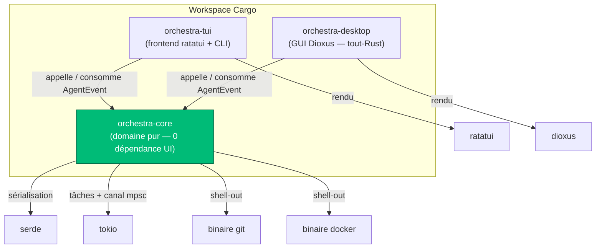
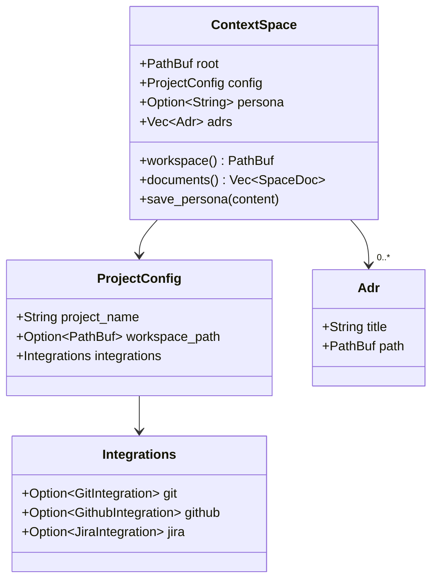
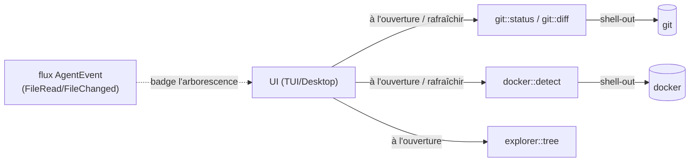
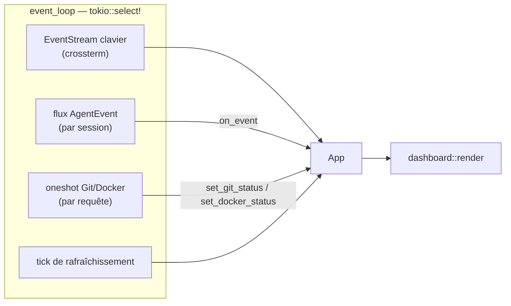

# Architecture technique — Orchestra IDE

> Doc technique vivante. Pour la vision produit, voir [`FONCTIONNEL.md`](./FONCTIONNEL.md) ;
> pour l'historique par phase, [`JOURNAL.md`](./JOURNAL.md).

## 1. Principe directeur : découplage strict métier / affichage

Orchestra IDE est un **outil de dev piloté par IA**. Deux UIs — un TUI `ratatui` et une GUI
de bureau Dioxus — donnent accès à la même chose : **toute la logique vit dans
`orchestra-core`, qui ne dépend d'AUCUNE bibliothèque d'affichage**. Les UIs ne font que :

1. appeler des fonctions du cœur (`scaffold_space`, `runtime::orchestrate`,
   `git::status`, `docker::detect`, `explorer::tree`…) ;
2. consommer le type-contrat `AgentEvent` pour tout ce qui est piloté par les agents.

C'est l'invariant non négociable du projet (`CLAUDE.md`) : toute feature nouvelle ou
améliorée est livrée **dans les deux UIs**, jamais une seule.

## 2. Vue d'ensemble des crates


```mermaid
graph TD
    subgraph workspace[Workspace Cargo]
        core["orchestra-core<br/>(domaine pur — 0 dépendance UI)"]
        tui["orchestra-tui<br/>(frontend ratatui + CLI)"]
        desktop["orchestra-desktop<br/>(GUI Dioxus — tout-Rust)"]
    end
    tui -->|appelle / consomme AgentEvent| core
    tui -->|rendu| ratatui
    desktop -->|appelle / consomme AgentEvent| core
    desktop -->|rendu| dioxus
    core -->|sérialisation| serde
    core -->|tâches + canal mpsc| tokio
    core -->|shell-out| gitcli["binaire git"]
    core -->|shell-out| dockercli["binaire docker"]

    style core fill:#0b7,stroke:#064,color:#fff
```

| Crate | Rôle | Dépendances clés |
|---|---|---|
| `orchestra-core` | Modèle, runtime d'agents, contrat d'événements, Git/Docker/Fichiers structurés | `serde`, `serde_json`, `thiserror`, `tokio`, `reqwest` |
| `orchestra-tui` | CLI (`init`) + tableau de bord temps réel (les 5 piliers) | `orchestra-core`, `ratatui`, `tokio`, `futures`, `crossterm` |
| `orchestra-desktop` | GUI bureau (Dioxus), **tout-Rust, sans IPC** — mêmes 5 piliers | `orchestra-core`, `dioxus` (desktop), `tokio` |

> **Deux UIs, un seul cœur.** Dioxus a été préféré à Tauri+React pour rester **tout-Rust** —
> l'UI appelle le cœur directement (pas de frontière IPC ni de toolchain Node). Build de
> `orchestra-desktop` : webview système (WebView2 sur Windows, `webkit2gtk`/GTK sur Linux) —
> **ne compile pas dans un conteneur cloud sans webview** ; s'itère en local.

### Arborescence des modules

```
crates/
├─ orchestra-core/src/
│  ├─ lib.rs            # ré-exports publics
│  ├─ error.rs          # OrchestraError (type d'erreur unique)
│  ├─ events.rs         # AgentEvent — contrat cœur ↔ UI
│  ├─ runtime.rs        # l'Orchestrateur : conversation + orchestrate() + spawn_agent
│  ├─ llm.rs            # LlmClient : Claude/Gemini au choix, HTTP brut, bascule + prompt caching
│  ├─ skills.rs         # primitives exécutables via tool use (Read_File, Execute_Terminal_Command…)
│  ├─ markdown_skill.rs # skills « fiches » SKILL.md + Load_Skill (divulgation progressive)
│  ├─ memory.rs         # mémoire partagée d'espace : Remember / Recall (.orchestra/memory.md)
│  ├─ integrations.rs   # Skills Git (local) + GitHub (REST), exposés à l'agent si configurés
│  ├─ git.rs            # état Git STRUCTURÉ (panneau Git des UIs) — indépendant du chemin LLM
│  ├─ docker.rs         # état Docker STRUCTURÉ, lecture seule (panneau Docker des UIs)
│  ├─ explorer.rs       # arborescence de fichiers du workspace (panneau Fichiers)
│  ├─ registry.rs       # registre global des espaces connus (récents) — partagé TUI/GUI
│  ├─ session.rs        # Sessions<T> : mécanique d'onglets (ouvrir/activer/fermer) — partagé
│  ├─ browser.rs        # navigateur de dossiers (découvrir un espace sans taper de chemin)
│  ├─ scaffold.rs       # scaffold_space() (créer) / adopt_project() (reprendre un projet existant)
│  ├─ orchestration.rs  # modèle Task/Plan pur (tri topo, validation) — voir note §5 ci-dessous
│  ├─ diff.rs           # diff texte ligne à ligne, sans dépendance (diffs d'agent)
│  └─ model/
│     ├─ config.rs        # ProjectConfig + Integrations (git/github/jira)
│     └─ space.rs         # ContextSpace (+ Adr, SpaceDoc, DocKind)
├─ orchestra-tui/src/
│  ├─ main.rs           # dispatch CLI + boucle async tokio::select! (multi-sessions/onglets)
│  ├─ app.rs            # App : état agrégé de toutes les vues (sans ratatui, testé)
│  ├─ dashboard.rs      # rendu de toutes les zones/vues
│  ├─ editor.rs         # mini-éditeur texte (persona & documents)
│  ├─ markdown.rs       # rendu Markdown → lignes ratatui (visualiseur)
│  └─ wizard.rs         # assistant interactif `orchestra init`
└─ orchestra-desktop/src/
   ├─ main.rs           # launch + racine : shell 5 zones (checkpoints · explorateur · centre · conversation · tâches)
   ├─ state.rs          # état + pont vers le cœur (Sessions<DesktopSession>, refresh_dev_status…)
   ├─ components.rs     # FileExplorer / CenterPane / TaskRail / SquadPanel / chat_view / SpaceBar
   └─ styles.rs         # CSS (thème vert sombre par défaut, thème clair)
```

## 3. Modèle de données — l'« Espace de Contexte »

Un Espace est **volontairement minimal et agnostique du domaine** : nom, éventuel workspace
de code, intégrations. **Aucun agent ni skill n'est pré-câblé** — l'Orchestrateur déploie sa
propre équipe à la volée (`spawn_agent`, §5).


```mermaid
classDiagram
    class ContextSpace {
        +PathBuf root
        +ProjectConfig config
        +Option~String~ persona
        +Vec~Adr~ adrs
        +workspace() PathBuf
        +documents() Vec~SpaceDoc~
        +save_persona(content)
    }
    class ProjectConfig {
        +String project_name
        +Option~PathBuf~ workspace_path
        +Integrations integrations
    }
    class Integrations {
        +Option~GitIntegration~ git
        +Option~GithubIntegration~ github
        +Option~JiraIntegration~ jira
    }
    class Adr {
        +String title
        +PathBuf path
    }
    ContextSpace --> ProjectConfig
    ContextSpace --> "0..*" Adr
    ProjectConfig --> Integrations
```

Sur le disque :

```
<espace>/.orchestra/
├─ config.json     # sérialisation de ProjectConfig
├─ persona.md      # contexte/critères rédigés par l'utilisateur
├─ memory.md       # mémoire partagée des agents (créée à la 1re note)
├─ skills/         # fiches de skills : <id>/SKILL.md
└─ adr/            # Architecture Decision Records (*.md)
```

`ContextSpace::workspace()` renvoie `workspace_path` si défini, sinon la racine de l'espace —
c'est cette racine qui sert de point d'ancrage aux panneaux **Fichiers**, **Git** et
**Docker**. **Règle d'accès** : l'UI ne touche jamais au système de fichiers directement,
elle passe par le cœur (`ContextSpace::load`/`documents`/`save_persona`,
`model::space::load_document`/`save_document`). Les intégrations ne stockent jamais de
secret en clair : seul le **nom** de la variable d'environnement du token est persisté
(`token_env_var`). Les anciens champs de config (`project_type`, `agents`, `skills`,
`documentalist_enabled`, d'une architecture antérieure à roster fixe) sont ignorés au
chargement (serde tolère l'inconnu).

## 4. Contrat d'événements `AgentEvent`

Pivot du découplage temps réel — piloté par les **agents** (contrairement à Git/Docker/
Fichiers, voir §6, qui sont interrogés directement par l'UI, en dehors de ce flux).

```rust
enum AgentEvent {
    Started  { agent: String },
    Thinking { agent: String },                          // appel LLM en cours → spinner
    Log      { agent: String, msg: String },
    Done     { agent: String },
    PlanReady   { tasks: Vec<PlannedTask> },              // Set_Plan
    TaskStarted { id: String, agent: String },            // Update_Step("running")
    TaskDone    { id: String },                           // Update_Step("done")
    TaskFailed  { id: String, error: String },            // Update_Step("failed")
    Terminal    { agent: String, command: String, output: String, ok: bool },
    FileRead    { agent: String, path: String },          // panneau Fichiers / Contexte
    FileChanged { agent: String, path: String, added: usize, removed: usize, diff: String },
}
```

## 5. L'Orchestrateur : un agent unique qui compose son équipe

`orchestra-core::runtime` n'a **pas de roster fixe**. Un seul agent principal, l'**Orchestrateur**
(`runtime::COORDINATOR = "Orchestrateur"`), mène une boucle **Percevoir → Penser → Agir →
Vérifier** et déploie lui-même des **sous-agents ad hoc** via l'outil `spawn_agent(role,
instruction)` — récursion async bornée (`Box::pin`), les sous-agents n'ont pas `spawn_agent`
(pas de récursion infinie).

Deux points d'entrée, tous deux exécutant la même boucle Orchestrateur :

- `runtime::start_conversation(space) -> ChatHandle { user, events, approve }` — conversation
  persistante (TUI `[5]`, Desktop « Assistant »). Canal bidirectionnel `mpsc`.
- `runtime::orchestrate(space, objectif) -> OrchestrationHandle` — objectif ponctuel en
  one-shot (TUI `[1]`).

**Outillage de l'Orchestrateur** (`orchestrator_tools`) : tous les Skills Dev exécutables
(§5bis) + intégrations Git/GitHub + mémoire + `Load_Skill` + `spawn_agent` + les outils de
**plan live** :

- `Set_Plan(steps: [String])` — publie (ou remplace) le plan dans le rail Tâches : émet
  `AgentEvent::PlanReady` avec une `PlannedTask` par étape (id = position, pas de dépendances
  formelles — la liste est **ordonnée**, pas un graphe).
- `Update_Step(step, status)` — `status` ∈ `running`/`done`/`failed`, émet
  `TaskStarted`/`TaskDone`/`TaskFailed`.

Le prompt PTAC impose à l'Orchestrateur de publier son plan **avant d'agir** et de le tenir à
jour — c'est ce mécanisme, pas une approbation préalable, qui alimente le panneau **Plan /
Tâches** des deux UIs.

> **Note sur `orchestration.rs`.** Ce module contient un modèle `Plan`/`Task` **pur et
> testé** (tri topologique, validation de dépendances, plan de repli linéaire) issu d'une
> architecture antérieure à roster fixe. Il n'est **plus câblé** au chemin d'exécution actuel
> (`Set_Plan`/`Update_Step` ci-dessus le remplace en pratique) : conservé comme brique
> potentiellement réutilisable (ex. validation d'un plan proposé), pas comme source de vérité
> du panneau Plan aujourd'hui.

## 5bis. Boucle agentique LLM + Skills exécutables

`orchestra-core::llm::LlmClient` appelle, en **HTTP brut** via `reqwest` (pas de SDK Rust
officiel), l'un des trois fournisseurs **au choix** :

| Provider | Endpoint | Modèle par défaut | Clé |
|---|---|---|---|
| `Anthropic` (Claude) | `POST /v1/messages` | `claude-opus-4-8` | `ANTHROPIC_API_KEY` |
| `Gemini` | `…/{model}:generateContent` | `gemini-2.5-flash` | `GEMINI_API_KEY` |
| `Ollama` (local) | `POST {host}/api/chat` (défaut `http://localhost:11434`) | `qwen2.5-coder` | **aucune** |

Une représentation **neutre** (`Msg`/`Block`/`ToolSpec`/`ToolResult`) découple la boucle
agentique du format de chaque fournisseur — `ollama_body`/`parse_ollama` rendent/parsent le
format `/api/chat` d'Ollama (proche d'OpenAI : un message assistant fusionne texte +
`tool_calls`, un résultat d'outil devient un message `tool` par appel, `arguments` accepté en
objet ou en chaîne JSON selon le modèle). **Secours pour les modèles sans `tool_calls`
fiable** (`fake_tool_call_from_text`) : certains modèles locaux (petits modèles notamment)
« miment » un appel d'outil en texte pur plutôt que via le champ structuré — `parse_ollama`
le détecte et l'exécute quand même si `content` est *entièrement* un JSON `{"name": ...,
"arguments": ...}`, ou si un bloc de code ```/```json contenant ce JSON apparaît n'importe où
dans un message par ailleurs narratif (« Essayons autrement :\n\`\`\`json\n{...}\n\`\`\` ») —
dans les deux cas seul l'intérieur d'un bloc délimité est scanné, jamais un texte narratif
contenant des accolades incidentes. **Bascule automatique** entre backends cloud :
Claude préféré, Gemini en repli si Claude est indisponible (réseau, 5xx, 429, ou crédit
épuisé) ; un échec permanent (401-403, crédit épuisé) écarte définitivement le backend.
**Ollama** ne demande aucune clé : `ORCHESTRA_PROVIDER=ollama` (ou `local`) le force en
fournisseur unique ; sans forçage, il ne rejoint la chaîne de repli automatique (après
Claude/Gemini) que si `ORCHESTRA_OLLAMA_MODEL` est explicitement défini — jamais par défaut,
pour ne changer le comportement d'aucune installation existante. `ORCHESTRA_OLLAMA_HOST`
surcharge l'hôte (utile si Ollama tourne sur une autre machine/port). Timeout par requête
**dédié et généreux** (`ORCHESTRA_OLLAMA_TIMEOUT_SECS`, défaut 600 s, via
`RequestBuilder::timeout` — n'affecte pas les 120 s des backends cloud) : l'inférence locale,
souvent CPU, est nettement plus lente qu'une API cloud, et un délai trop court s'y manifeste
comme une « erreur réseau » trompeuse (connexion coupée en pleine génération) plutôt que comme
un vrai signal d'indisponibilité. **Fenêtre de contexte explicite** (`options.num_ctx`,
défaut **8192**, surchargeable par `ORCHESTRA_OLLAMA_NUM_CTX`) : le défaut Ollama
(souvent 2048-4096) est trop court pour un agent outillé — system prompt PTAC + toutes les
définitions d'outils peuvent déjà l'approcher avant même la conversation, causant une perte de
contexte qui se manifeste comme un modèle anormalement peu fiable ou exigeant des instructions
très courtes. Sans aucun fournisseur
disponible → mode simulé (l'appli reste utilisable hors-ligne). `run_agent_turn` (mutualisé
Orchestrateur/sous-agents) borne chaque message à `max_turns()` tours LLM ↔ outils
(`DEFAULT_MAX_TURNS = 40`, surchargeable par `ORCHESTRA_MAX_TURNS`).

| Skill (tool) | Action | Garde-fou |
|---|---|---|
| `Read_File` | lit un fichier texte | chemin confiné au workspace |
| `Write_File_Validated` | écrit/remplace un fichier | idem + création des parents |
| `Execute_Terminal_Command` | commande shell dans le workspace | `cwd`=workspace, délai configurable (300 s par défaut), sortie plafonnée |
| `Write_Mermaid_Diagram` | écrit un `.md` avec un bloc `mermaid` | type de diagramme validé |
| `Web_Fetch` | lit le contenu d'une URL | schémas `http(s)` uniquement, délai, sortie plafonnée |

Chaque écriture/commande émet aussi `AgentEvent::FileChanged`/`Terminal` — c'est ce qui
alimente les panneaux **Modifications**, **Terminal** et **Contexte** des deux UIs, en plus
du radar/chat.

### Intégrations Git / GitHub (outils LLM, conditionnels)

`orchestra-core::integrations` ajoute des Skills **au LLM uniquement si configurés** dans
`config.integrations` :

| Intégration | Skills | Exécution | Exposé si |
|---|---|---|---|
| Git (local) | `Git_Status`, `Git_Diff`, `Git_Create_Branch`, `Git_Commit` | binaire `git`, via `git::run_command` (§6) | `integrations.git` présent |
| GitHub (REST) | `GitHub_List_Issues`, `GitHub_Create_Issue_Comment`, `GitHub_Create_Pull_Request` | API `api.github.com` (`reqwest`) | `integrations.github` présent **et** token résolu |

`integrations.rs` **délègue le shell-out `git` au module `git.rs`** (`run_command`) — source
unique pour tout appel `git`, qu'il vienne d'un outil LLM ou du panneau Git passif (§6).
Jira reste une **intégration déclarable en config mais non implémentée** (pas d'entrée dans
`integrations.rs`) — à faire au même schéma que GitHub le jour où elle est priorisée.

### Skills « fiches » Markdown + mémoire partagée

`markdown_skill.rs` charge `.orchestra/skills/<id>/SKILL.md` (nom+description injectés dans
le prompt, corps chargé à la demande via `Load_Skill{id}` — divulgation progressive, économie
de tokens). `memory.rs` expose `Remember{note}`/`Recall{query?}` à **tous** les agents : notes
numérotées, durables entre sessions, dans `.orchestra/memory.md` — listées par
`memory::entries()`, source du panneau **Mémoire**.

## 6. Git / Docker / Fichiers : panneaux de constat, **hors** du flux `AgentEvent`

Contrairement aux piliers Plan/Tâches et Agents (pilotés par les événements des agents), les
panneaux **Fichiers**, **Git** et **Docker** répondent à une question factuelle sur l'état du
projet, indépendante de toute conversation en cours. Modèle **pull** : les UIs appellent ces
fonctions directement (à l'ouverture d'un écran/onglet, ou sur demande via une touche
« rafraîchir ») plutôt que d'attendre un événement poussé par le runtime.

- **`explorer::tree(root) -> Tree`** (sync) — arborescence à plat (`Vec<FileNode>` avec
  `depth`), dossiers bruyants ignorés (`.git`, `target`, `node_modules`…), bornée à 800
  entrées. Les deux UIs l'annotent avec l'activité live tirée du flux `AgentEvent`
  (`FileRead`/`FileChanged`) — c'est le seul point où les deux modèles (pull + push) se
  recoupent visuellement.

- **`git::status(root) -> GitStatus`** (async) — `git status --porcelain=v2 --branch` parsé :
  branche, upstream, ahead/behind, fichiers `staged`/`unstaged`/`untracked`. Jamais d'erreur
  remontée à l'UI : si `root` n'est pas un dépôt (ou `git` absent), `GitStatus::default()`
  (`is_repo: false`) — état neutre affiché tel quel. `git::diff(root, path)` (async) renvoie
  le texte `git diff` (non indexé), vide si rien à montrer.

- **`docker::detect(root) -> DockerStatus`** (async) — détecte `Dockerfile`/fichier compose à
  la racine, interroge `docker compose ps --format json` (JSON array **ou** NDJSON selon la
  version de Compose, les deux sont gérés) si le démon est joignable. **Lecture seule** —
  aucune action start/stop/logs dans cette version. `docker_available: false` en l'absence du
  binaire ou démon injoignable : jamais d'erreur bloquante, un état neutre.


```mermaid
graph LR
    ui["UI (TUI/Desktop)"] -->|à l'ouverture / rafraîchir| gitmod["git::status / git::diff"]
    ui -->|à l'ouverture / rafraîchir| dockermod["docker::detect"]
    ui -->|à l'ouverture| explmod["explorer::tree"]
    gitmod -->|shell-out| gitcli[("git")]
    dockermod -->|shell-out| dockercli[("docker")]
    agentevt["flux AgentEvent<br/>(FileRead/FileChanged)"] -.->|badge l'arborescence| ui
```

## 7. Sessions en onglets

`orchestra-core::session::Sessions<T>` (générique sur un trait `Tabbed`) gère l'ouverture,
l'activation, la fermeture et le cycle entre plusieurs Espaces ouverts **simultanément** —
mécanique pure, testée, partagée TUI/Desktop. Rouvrir un Espace déjà ouvert réactive son
onglet (pas de doublon). `orchestra-core::registry` persiste la liste des espaces **connus**
(`<config>/orchestra/spaces.json`) pour les rouvrir en un clic (`browser.rs` complète avec un
navigateur de dossiers pour découvrir un espace sans taper de chemin).

## 8. Boucle d'affichage asynchrone (`orchestra-tui`)


```mermaid
graph LR
    subgraph loop["event_loop — tokio::select!"]
        kbd["EventStream clavier<br/>(crossterm)"]
        chan["flux AgentEvent<br/>(par session)"]
        gitdocker["oneshot Git/Docker<br/>(par requête)"]
        tick["tick de rafraîchissement"]
    end
    kbd --> state[App]
    chan -->|on_event| state
    gitdocker -->|set_git_status / set_docker_status| state
    tick --> state
    state --> render[dashboard::render]
```

`App` (dans `app.rs`) agrège tout — flux d'agents, résultats Git/Docker en attente (canaux
`oneshot`), historique borné — **sans dépendre de ratatui**, ce qui le rend testable
(rendu headless via `ratatui::backend::TestBackend`). `dashboard.rs` est purement du rendu.
Chaque session (onglet) garde son propre `App` et ses propres canaux ; une session en
arrière-plan continue de recevoir ses événements.

## 9. Gestion des erreurs

Type unique `OrchestraError` (via `thiserror`) : `SpaceNotFound`, `SpaceAlreadyExists`,
`InvalidConfig`, `SkillAlreadyExists`, `InvalidSkillName`, `Io`. Git/Docker n'utilisent
**pas** ce type : leurs fonctions ne remontent jamais d'erreur à l'UI, seulement des états
neutres (`is_repo: false`, `docker_available: false`) — cohérent avec leur rôle de panneaux
de constat qui ne doivent jamais bloquer l'interface.

## 10. Conventions & tests

- **Langue du code et des messages** : français (domaine et UI francophones).
- **Découplage** : aucune dépendance UI ne doit remonter dans `orchestra-core`.
- **Tests** (`cargo test -p orchestra-core -p orchestra-tui`) : modèle, `git`/`docker`
  (parsing, détection, dépôt temporaire réel), `scaffold`, `runtime` (hors-ligne),
  `App`/`dashboard` (rendu **headless** via `TestBackend`, y compris tous les nouveaux
  écrans à plusieurs tailles de terminal).
- **Qualité** : `cargo clippy -p orchestra-core -p orchestra-tui --all-targets -- -D
  warnings` doit rester sans warning. `orchestra-desktop` ne peut pas être compilé dans un
  environnement cloud sans webview — vérification manuelle attentive + build local requis
  avant de considérer une feature desktop terminée.
