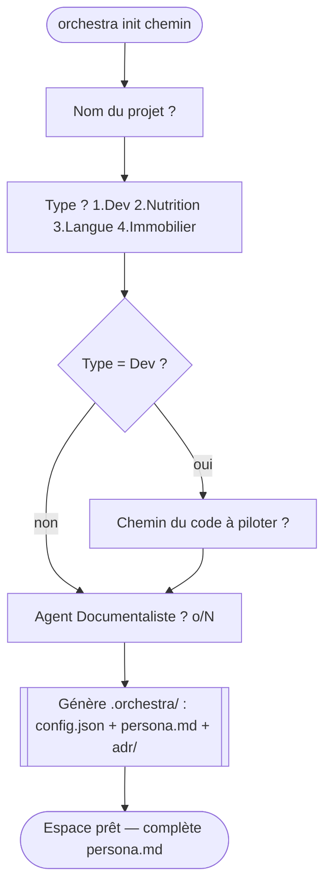

# Documentation fonctionnelle — Orchestra IDE

> Ce que fait l'outil, pour qui, et comment on s'en sert. Pour les détails d'implémentation,
> voir [`ARCHITECTURE.md`](./ARCHITECTURE.md) ; pour l'avancement, [`JOURNAL.md`](./JOURNAL.md).

## 1. Vision

Orchestra IDE est un **« IDE pour l'ère agentique »** : un poste de pilotage où l'on ne
manipule pas du code ligne à ligne, mais un **orchestre d'agents** qui travaillent pour
nous sur un objectif. L'outil est **agnostique du domaine** : il sert aussi bien à
développer un logiciel qu'à organiser une recherche immobilière, un plan nutritionnel ou
l'apprentissage d'une langue.

## 2. Concept clé : l'Espace de Contexte

Tout part d'un **Espace de Contexte** : un dossier qui rassemble *tout ce qu'il faut
savoir* pour qu'un orchestre d'agents travaille sur un sujet donné.

Un Espace contient :

| Élément | Rôle |
|---|---|
| **Type de projet** | `Dev`, `Nutrition`, `Langue` ou `Immobilier` — détermine les agents et Skills par défaut |
| **Persona** (`persona.md`) | Le contexte et les critères rédigés par l'utilisateur (budget, régime, niveau, conventions de code…) |
| **Agents** | Les membres de l'orchestre (ex. `Agent_Scraper`, `Agent_Codeur`) |
| **Skills** | Les capacités : **primitives** exécutables (code : `Read_File`, `Web_Fetch`…) et **fiches** d'instructions (`skills/<id>/SKILL.md`, sans code) |
| **Mémoire** (`memory.md`) | Notes partagées entre agents et entre sessions (faits, décisions, synthèses) |
| **ADRs** | Les décisions structurantes consignées (`adr/*.md`) |
| **Intégrations** | Git / GitHub (actives si configurées) ; Jira à venir |

### Matrice des types de projet

| Type | Agents par défaut | Skills par défaut |
|---|---|---|
| **Dev** | Agent_Architecte, Agent_Codeur, Agent_Testeur | Read_File, Write_File_Validated, Execute_Terminal_Command |
| **Nutrition** | Agent_Planificateur, Agent_Nutritionniste | Web_Search, Calorie_Calculator, File_Append |
| **Langue** | Agent_Tuteur, Agent_Correcteur | Generate_Quiz, Translate_Text, Text_To_Speech |
| **Immobilier** | Agent_Scraper, Agent_Filtrage | Scrape_Web_Page, Extract_JSON_From_HTML, Geocoding_Calcul |

## 3. Parcours utilisateur

### a) Créer un Espace — `orchestra init`

```bash
cargo run -p orchestra-tui -- init ./ma-recherche
```

Un assistant interactif pose quelques questions :



Le résultat est un dossier `.orchestra/` pré-rempli avec les agents et Skills adaptés au
type choisi. Un Espace déjà existant **n'est jamais écrasé**.

### b) Piloter l'orchestre — le tableau de bord

```bash
cargo run -p orchestra-tui -- ./ma-recherche
```

Le tableau de bord (TUI) s'ouvre en 3 zones :

```
┌─ ORCHESTRA IDE v0.1.0 | [Recherche_Immo_Aix] (Immobilier) | ● au repos ──┐
├─ 🛰  ÉCRAN RADAR (FLUX D'ACTIVITÉ DES AGENTS) ───────────────────────────┤
│   Prêt. Appuie sur [1] pour lancer l'orchestre.                          │
├─ 📋 OPTIONS & MENUS ─────────────────────────────────────────────────────┤
│  [1] Lancer l'orchestre  [2] Voir les ADRs  [3] Changer d'Espace  [q]…   │
└──────────────────────────────────────────────────────────────────────────┘
```

| Touche | Action | État |
|---|---|---|
| `[1]` | Orchestrer un objectif : plan (tâches + dépendances) → approbation → exécution → synthèse | ✅ actif |
| `[5]` | Converser avec le chef d'orchestre (délègue aux agents, historique conservé) | ✅ actif |
| `[2]` | Navigateur de documents (persona/mémoire/ADRs/docs) + visualiseur Markdown | ✅ actif |
| `[3]` | Changer d'Espace (saisie d'un chemin) | ✅ actif (5) |
| `[4]` | Éditer le persona dans l'interface (`Ctrl+S` enregistre) | ✅ actif |
| `[6]` | Gérer les agents (rôle, skills, stats ; renommer/éditer/ajouter/supprimer) + `[n]` créer un skill « fiche » | ✅ actif |
| `q` / `Échap` | Quitter | ✅ actif |

Quand l'orchestre tourne, l'en-tête indique `▶ N agent(s) en cours`, le radar liste les
démarrages, les logs et les fins d'agents, puis bascule en `✓ terminé`.

## 4. État des fonctionnalités

| Capacité | État | Phase |
|---|---|---|
| Modèle d'Espace de Contexte agnostique | ✅ | 1 |
| Tableau de bord 3 zones | ✅ | 1 |
| Création d'Espace assistée (`init`) | ✅ | 2 |
| Radar temps réel (flux d'agents) | ✅ | 3 |
| **Agents intelligents (LLM Claude ou Gemini)** | ✅ avec clé API | 4a |
| Skills Dev exécutables (lecture/écriture fichier, terminal) | ✅ | 4a |
| Skill `Web_Fetch` (lecture d'URL) + registre de primitives | ✅ | post-5 |
| Skills « fiches » Markdown (`SKILL.md`) + création depuis l'UI (`[n]`) | ✅ | post-5 |
| Divulgation progressive des fiches (`Load_Skill`) | ✅ | post-5 |
| Mémoire partagée d'espace (`Remember` / `Recall`) | ✅ | post-5 |
| Économie de tokens (prompt caching Anthropic) | ✅ | post-5 |
| Orchestration réelle (plan → approbation → exécution → synthèse) | ✅ | post-5 |
| Repli simulé hors-ligne (sans clé) | ✅ | 4a |
| Intégration Git (statut, diff, branche, commit) | ✅ si configuré | 4b |
| Intégration GitHub (issues, commentaire, PR) | ✅ si configuré + token | 4b |
| Intégration Jira | ❌ | 4c |
| Changement d'Espace dans l'UI (`[3]`) | ✅ | 5 |
| Navigateur de documents + visualiseur Markdown (`[2]`) | ✅ | post-5 |
| Éditeur de persona intégré (`[4]`) | ✅ | post-5 |
| Gestionnaire d'agents (rôle/skills/stats, éditable) (`[6]`) | ✅ | post-5 |
| Agent Documentaliste (doc auto, Mermaid) | ✅ si activé | 5 |

### Activer le LLM — Claude ou Gemini, au choix

Les agents appellent réellement un LLM dès qu'une clé API est exposée :

```bash
export ANTHROPIC_API_KEY="sk-ant-..."   # Claude (défaut claude-opus-4-8)
# ou
export GEMINI_API_KEY="..."             # Gemini (défaut gemini-2.0-flash)

# Optionnel : forcer le fournisseur / le modèle
export ORCHESTRA_PROVIDER=gemini        # anthropic | gemini
export ORCHESTRA_MODEL=gemini-2.0-flash

cargo run -p orchestra-tui -- examples/recherche-immo-aix
```

Le fournisseur est choisi automatiquement selon la clé présente (`ANTHROPIC_API_KEY` puis
`GEMINI_API_KEY`) ; `ORCHESTRA_PROVIDER` a priorité. Les clés sont lues depuis
l'environnement, jamais en dur.

L'en-tête du dashboard affiche le mode : `🤖 <modèle>` quand un LLM est actif, sinon
`simulé · clé API absente`. **Sans clé (ou si l'API est injoignable), l'appli bascule
automatiquement en mode simulé** — elle reste pleinement utilisable hors-ligne, et le radar
rappelle quelles variables définir.

> ⚠️ Le Skill `Execute_Terminal_Command` exécute de vraies commandes shell dans le
> workspace. C'est une capacité assumée pour un IDE de développement, encadrée (workspace
> uniquement, délai max, sortie plafonnée) — mais à utiliser en connaissance de cause.

### Activer les intégrations Git / GitHub (Phase 4b)

Les agents gagnent des Skills supplémentaires **si l'intégration est déclarée** dans
`.orchestra/config.json` :

```json
"integrations": {
  "git": { "auto_branching": true, "main_branch": "main" },
  "github": { "repo": "owner/repo", "token_env_var": "GITHUB_TOKEN" }
}
```

```bash
export GITHUB_TOKEN="ghp_..."     # requis pour les Skills GitHub
```

- **Git** (local) : `Git_Status`, `Git_Diff`, `Git_Create_Branch`, `Git_Commit`.
- **GitHub** (REST) : `GitHub_List_Issues`, `GitHub_Create_Issue_Comment`,
  `GitHub_Create_Pull_Request` — exposés seulement si le token est présent.

Le modèle ne voit que les Skills réellement actionnables : sans intégration configurée (ou
sans token), ces outils n'apparaissent pas. Jira suivra le même schéma (Phase 4c).

### Skills : deux couches (primitives vs fiches)

Un skill n'agit que s'il est **branché**. Deux façons de l'être :

- **Primitive (code)** — capacité réelle implémentée en Rust : `Read_File`,
  `Write_File_Validated`, `Execute_Terminal_Command`, `Write_Mermaid_Diagram`, `Web_Fetch`,
  + Git/GitHub si configurés. Le menu Agents les marque **en vert**.
- **Fiche (`SKILL.md`, sans code)** — un dossier `.orchestra/skills/<id>/SKILL.md` (en-tête
  `name`/`description` + corps Markdown du « comment faire »). Tout agent à qui la fiche est
  assignée en voit le **nom + la description** dans son prompt et charge la procédure complète
  à la demande (`Load_Skill`). Crée-en une **sans quitter l'outil** : menu Agents `[6]` →
  `[n]` → saisis un nom → rédige dans l'éditeur → `Ctrl+S`. Marquées **(fiche)** en cyan ; un
  skill sans aucun des deux reste une étiquette **(inactif)** en gris.

Idéal : `Creation_Quiz` (pur texte → fiche) ; `Web_Search` (une fiche qui s'appuie sur la
primitive `Web_Fetch`).

### Orchestration d'un objectif (`[1]`)

Plutôt que de diffuser la même consigne à tous les agents, `[1]` fait travailler l'orchestre
comme un vrai orchestre :

1. **Plan** — le chef décompose l'objectif en **tâches** assignées à des agents, reliées par des
   dépendances (qui doit passer avant qui).
2. **Approbation** — le plan s'affiche ; tu l'exécutes (`Entrée`) ou l'annules (`Échap`).
3. **Exécution ordonnée et parallèle** — les tâches **indépendantes s'exécutent en même temps** ;
   une tâche n'attend que ses prérequis. Chaque agent reçoit en contexte les résultats de ses
   dépendances et **consigne le sien en mémoire** (passage de relais).
4. **Auto-correction** — le chef évalue si l'objectif est atteint ; sinon il propose un **plan
   correctif** (que tu ré-approuves) et relance une manche, jusqu'à satisfaction (ou une limite).
5. **Synthèse** — le chef agrège les comptes rendus de toutes les manches en une réponse finale.

Le panneau **Plan** suit l'avancement en direct (⋯ en attente · ▶ en cours · ✓ fait · ✗ échec).
Sans clé API, le plan de repli (pipeline linéaire) et un flux simulé restent fonctionnels.

### Mémoire partagée

Tous les agents disposent de deux outils universels :

- **`Remember{note}`** — consigne un fait, une décision ou une synthèse dans
  `.orchestra/memory.md` (durable entre sessions, visible dans le navigateur `[2]`).
- **`Recall{query?}`** — relit la mémoire, filtrée par mot-clé.

C'est à la fois la **mémoire de l'orchestre** (le travail se capitalise) et un **levier
d'économie de tokens** : un agent résume une source volumineuse une fois, les autres lisent
la synthèse au lieu de relire le fichier.

## 5. Exemple fourni

`examples/recherche-immo-aix/` est un Espace Immobilier prêt à ouvrir pour découvrir le
tableau de bord et le radar sans rien créer.
