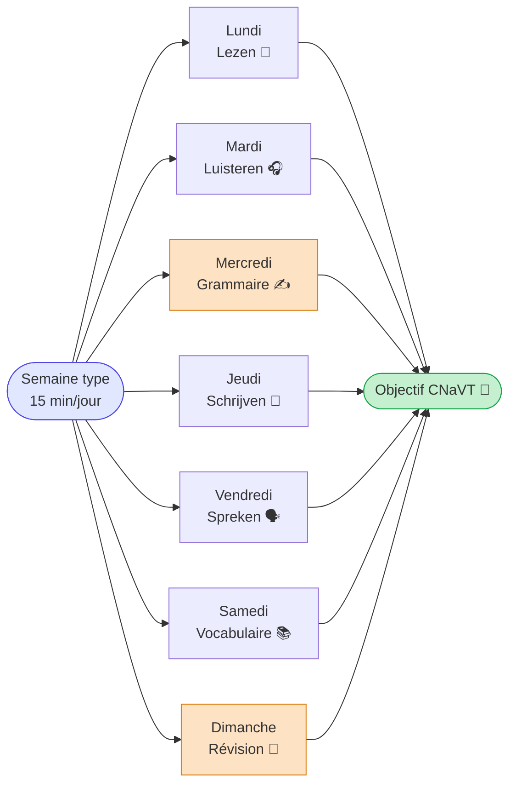

# Couverture hebdomadaire des compétences (15 min/jour)

```mermaid
graph LR
    W(["Semaine type<br/>15 min/jour"]) --> L1["Lundi<br/>Lezen 📖"]
    W --> L2["Mardi<br/>Luisteren 🎧"]
    W --> L3["Mercredi<br/>Grammaire ✍️"]
    W --> L4["Jeudi<br/>Schrijven 📝"]
    W --> L5["Vendredi<br/>Spreken 🗣️"]
    W --> L6["Samedi<br/>Vocabulaire 📚"]
    W --> L7["Dimanche<br/>Révision 🔁"]

    L1 --> CNaVT(["Objectif CNaVT 🎯"])
    L2 --> CNaVT
    L3 --> CNaVT
    L4 --> CNaVT
    L5 --> CNaVT
    L6 --> CNaVT
    L7 --> CNaVT

    style W fill:#e0e7ff,stroke:#4f46e5
    style L3 fill:#fde2c4,stroke:#d97706
    style L7 fill:#fde2c4,stroke:#d97706
    style CNaVT fill:#c4f0d0,stroke:#16a34a
```
