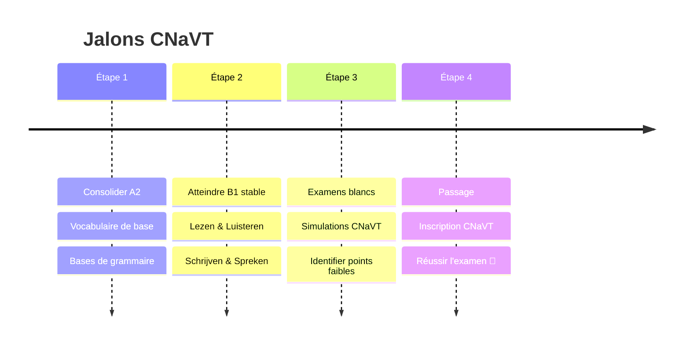

# Jalons vers le CNaVT (timeline)

```mermaid
timeline
    title Jalons CNaVT
    Étape 1 : Consolider A2 : Vocabulaire de base : Bases de grammaire
    Étape 2 : Atteindre B1 stable : Lezen & Luisteren : Schrijven & Spreken
    Étape 3 : Examens blancs : Simulations CNaVT : Identifier points faibles
    Étape 4 : Passage : Inscription CNaVT : Réussir l'examen 🎯
```
