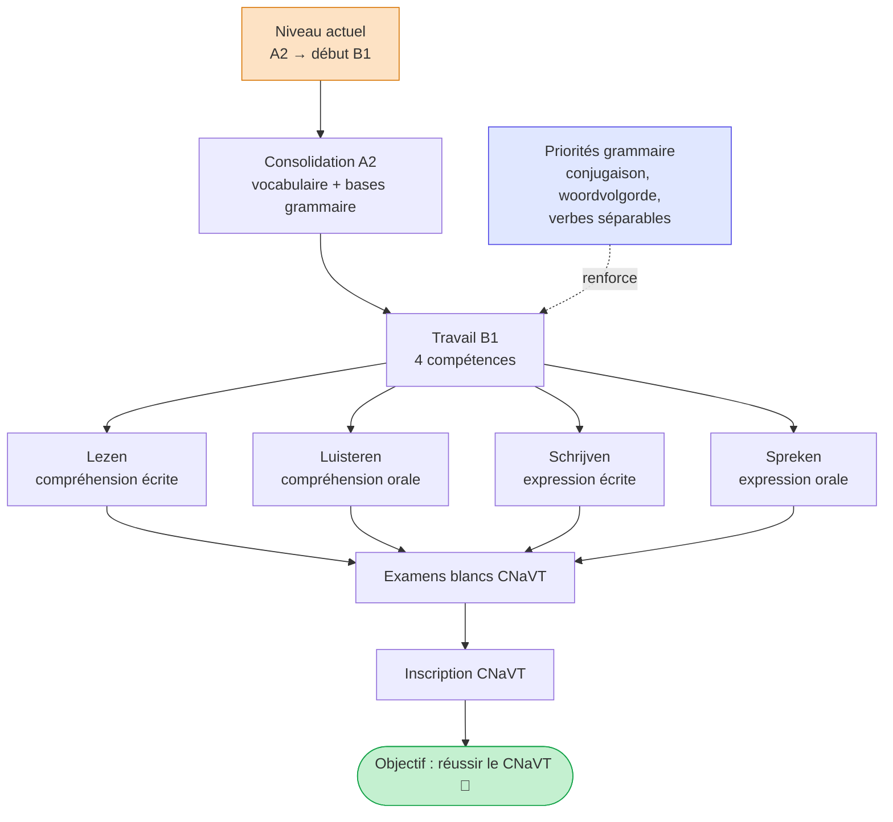

# Parcours d'apprentissage vers le CNaVT

```mermaid
graph TD
    A["Niveau actuel<br/>A2 → début B1"] --> B["Consolidation A2<br/>vocabulaire + bases grammaire"]
    B --> C["Travail B1<br/>4 compétences"]

    C --> C1["Lezen<br/>compréhension écrite"]
    C --> C2["Luisteren<br/>compréhension orale"]
    C --> C3["Schrijven<br/>expression écrite"]
    C --> C4["Spreken<br/>expression orale"]

    C1 --> D
    C2 --> D
    C3 --> D
    C4 --> D

    G["Priorités grammaire<br/>conjugaison, woordvolgorde,<br/>verbes séparables"] -.renforce.-> C

    D["Examens blancs CNaVT"] --> E["Inscription CNaVT"]
    E --> F(["Objectif : réussir le CNaVT 🎯"])

    style A fill:#fde2c4,stroke:#d97706
    style F fill:#c4f0d0,stroke:#16a34a
    style G fill:#e0e7ff,stroke:#4f46e5
```
