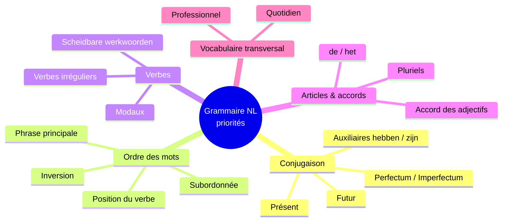

# Priorités grammaticales — Néerlandais

```mermaid
mindmap
  root(("Grammaire NL<br/>priorités"))
    Conjugaison
      Présent
      Perfectum / Imperfectum
      Futur
      Auxiliaires hebben / zijn
    Ordre des mots
      Phrase principale
      Subordonnée
      Position du verbe
      Inversion
    Verbes
      Scheidbare werkwoorden
      Verbes irréguliers
      Modaux
    Articles & accords
      de / het
      Accord des adjectifs
      Pluriels
    Vocabulaire transversal
      Quotidien
      Professionnel
```
