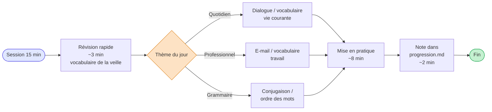

# Routine quotidienne (15 min/jour)

```mermaid
flowchart LR
    Start([Session 15 min]) --> Review["Révision rapide<br/>~3 min<br/>vocabulaire de la veille"]
    Review --> Theme{Thème du jour}

    Theme -->|Quotidien| Q["Dialogue / vocabulaire<br/>vie courante"]
    Theme -->|Professionnel| P["E-mail / vocabulaire<br/>travail"]
    Theme -->|Grammaire| G["Conjugaison /<br/>ordre des mots"]

    Q --> Practice["Mise en pratique<br/>~8 min"]
    P --> Practice
    G --> Practice

    Practice --> Log["Note dans<br/>progression.md<br/>~2 min"]
    Log --> End([Fin])

    style Start fill:#e0e7ff,stroke:#4f46e5
    style End fill:#c4f0d0,stroke:#16a34a
    style Theme fill:#fde2c4,stroke:#d97706
```
